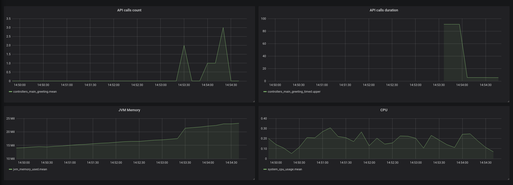

# Spring Micrometer Metrics PoC

This project is a *Proof of Concept* of how to use *Micrometer facade* with *Spring Boot 2*.

The metrics we use are very simple. It's just a *PoC*.

The application is formed by this set of components:

 - `MicrometerMetricsPoc`: This application. It exposes an endpoint at http://localhost:8080 and every time this endpoint is hit it will register a new metric.
 - [InfluxDB](https://www.influxdata.com): The database used to store the metrics.
 - [Grafana](https://grafana.com/): The monitoring tool used to analyze and view the metrics.
 
# Prerequisites

 - ```Java``` and ```Maven```: In order to compile and run the application.
 - ```docker-compose```: In order to run *InfluxDB* and *Grafana*.

# How to run

*Grafana* needs full permissions on the mapped volume so:

```
$ cd docker-local
$ sudo chmod -R 777 grafana-data
```

Start the services. From ```docker-local``` directory:

```
$ docker-compose up
```

Now you can check that *InfluxDB* is alive:

```
curl -I "http://localhost:8086/ping"
```

And so is *Grafana*:

```
curl -I "http://localhost:3000"
```

Build the application and run it:

```
$ mvn clean install
$ mvn spring-boot:run
```

Go to *Grafana* at http://localhost:3000, login with ```admin/admin```. You may be asked to change the password. Once you get in
go to the ```App``` dashboard.

If you hit http://localhost:8080 several times you will see how the dashboard is updated.

